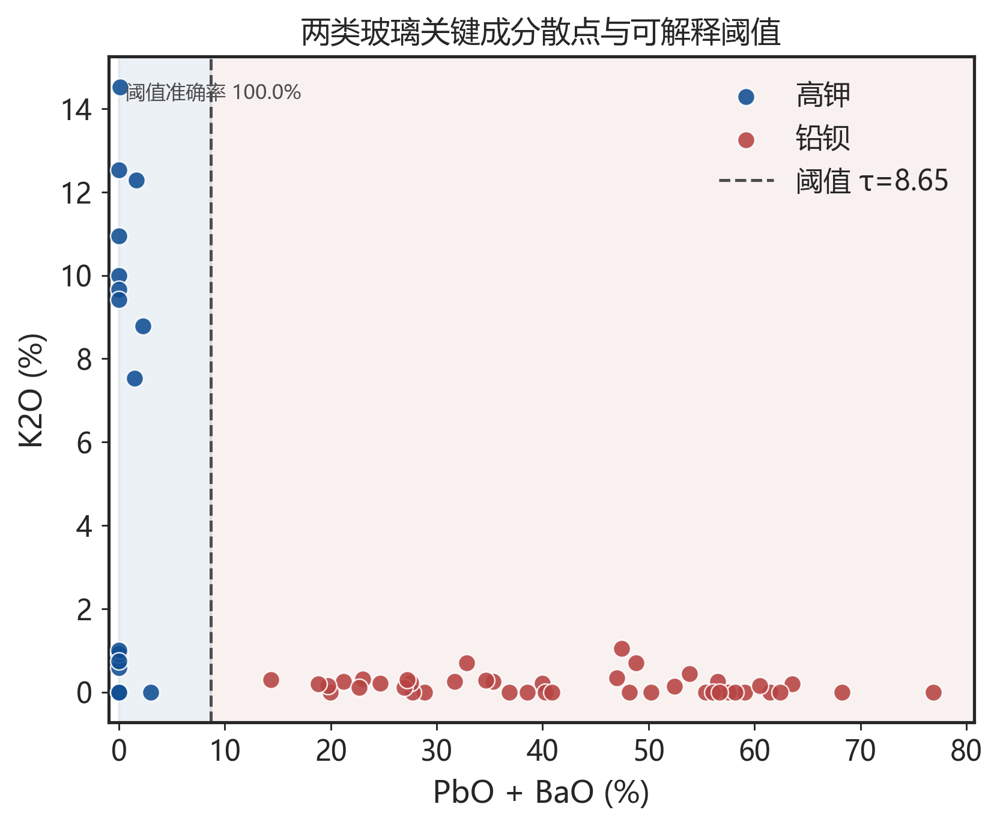
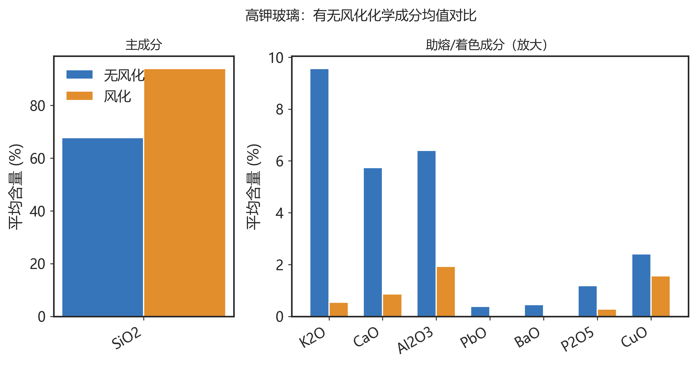
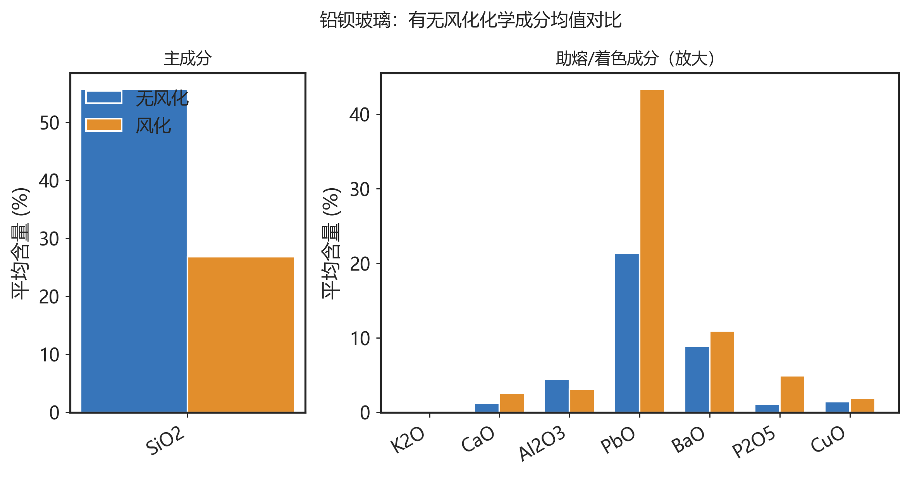
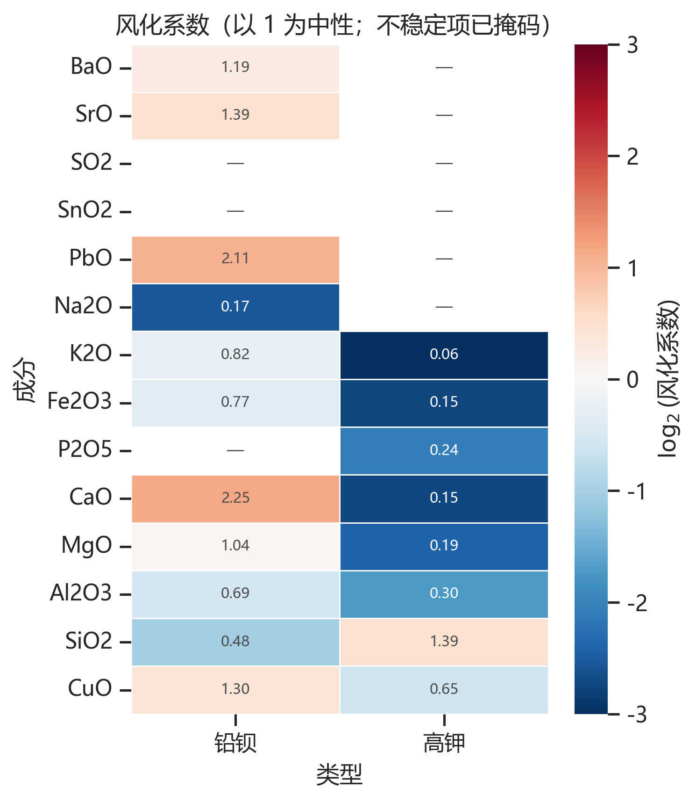
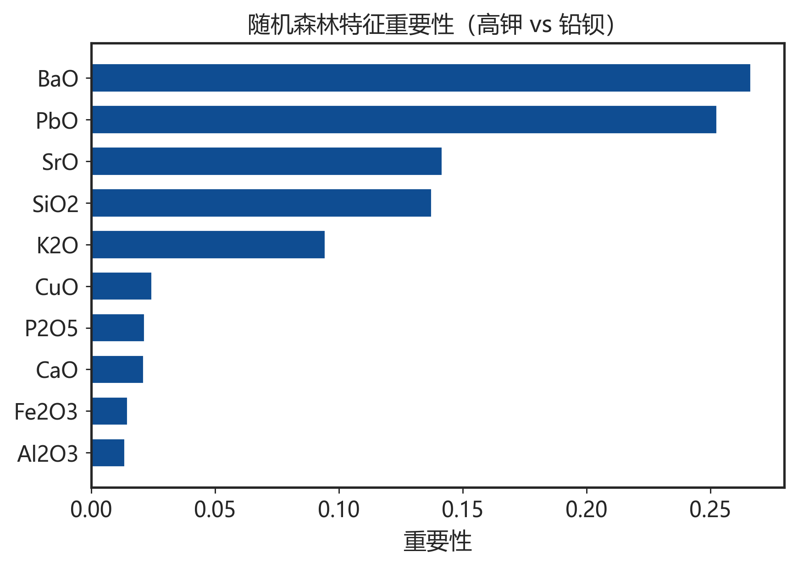
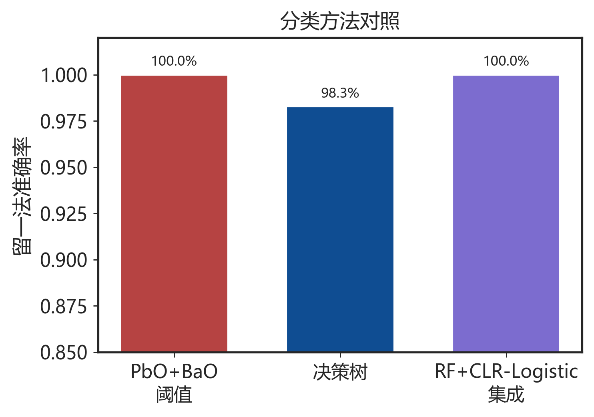

# 古代玻璃制品的成分分析与鉴别

全国大学生数学建模竞赛参赛队  
2022年高教社杯 C题

---

## 摘要

古代玻璃在埋藏环境中易发生风化，成分比例随之改变，给类型鉴别带来困难。本文基于附件中 58 件文物的基本信息与 69 个化学成分采样点，在成分累加和 $85\%\sim105\%$ 的有效性约束下，建立风化关联分析、风化前成分还原、类型判别与亚类划分、未知样品鉴别及成分关联比较的完整模型体系。

**问题一**采用列联表 $\chi^2$ 检验与 Cramer's $V$；Mann–Whitney $U$ 检验后以 Benjamini–Hochberg FDR 控制多重比较；定义风化系数并给出 bootstrap 置信区间，对不稳定成分不做校正。结果表明：风化与玻璃类型显著相关（$p=0.0195$，$V=0.307$）；高钾“硅升钾失”，铅钡“硅降铅磷富集”。

**问题二**以决策树、Logistic 与随机森林提炼分类规律，并以 $\mathrm{PbO}+\mathrm{BaO}$ 阈值给出可解释判别；零值乘法替换后做 CLR，再层次聚类。单阈值与随机森林留一法准确率均达 $97.0\%$；两类各分 3 亚类，轮廓系数 $0.489$ 与 $0.528$，高钾小簇仅作候选解释。

**问题三**随机森林鉴别表单 3，并与阈值规则交叉印证：A1、A6、A7 为高钾，其余为铅钡，二者完全一致；$\sigma=5\%$ 时翻转率为 0。

**问题四**Spearman 与 CLR–Pearson 并用；Mantel 相似度 $0.216$（$p=0.161$），未能拒绝结构相同，但主导相关对不同；CLR 对照提示定和假相关风险。

**关键词：** 成分数据；风化系数；FDR；中心对数比变换；随机森林；层次聚类；Spearman 相关

---

## 1. 问题重述

丝绸之路沿线出土的古代玻璃，外观可能与外来制品相近，但因助熔剂不同，化学成分存在本质差别。我国古代玻璃大体可分为**高钾玻璃**与**铅钡玻璃**两类。埋藏过程中的风化会使内部元素与环境元素大量交换，成分比例改变，从而干扰类型判断。

题目给出：表单 1（文物纹饰、类型、颜色、表面风化），表单 2（已分类样品 14 种氧化物含量），表单 3（8 件未知类别样品）。成分累加和介于 $85\%\sim105\%$ 的数据视为有效。需要解决：

1. 分析表面风化与类型、纹饰、颜色的关系；结合类型给出有无风化的成分统计规律，并由风化点预测风化前成分；
2. 提炼高钾/铅钡分类规律，对各类做亚类划分，并评估合理性与敏感性；
3. 鉴别表单 3 未知样品的类型，并做敏感性分析；
4. 分析不同类别成分关联关系，并比较两类之间的差异。

---

## 2. 问题分析

**图：** 两类玻璃在 $\mathrm{PbO}+\mathrm{BaO}$–$\mathrm{K_2O}$ 平面上的可解释分离（阈值准确率 97%）

**问题一**属于分类变量关联 + 成分对比 + 逆向还原。还原结果应理解为同类型平均意义下的校正。

**问题二**是有监督分类规律提取 + 无监督亚类发现。分类侧强调可解释规则并与黑盒对照；亚类侧先做零值乘法替换再 CLR。

**问题三**是迁移预测，并用阈值规则做一致性检验。

**问题四**同时报告 Spearman 与 CLR 相关，警惕定和假相关。

---

## 3. 模型假设与符号说明

### 3.1 模型假设

1. 空白（未检出）成分按 $0$ 处理；累加和在 $[85,105]$ 内的采样点为有效数据。
2. 表单 2 中“严重风化点”视为风化，“未风化点”视为无风化；其余与表单 1 一致。
3. 同一类型风化具有可迁移的平均规律；预测为平均意义下的还原，非个体真值。
4. 检测误差相对风化效应为小量。
5. 亚类反映原料/工艺或风化程度差异；小样本簇仅作候选亚型。
6. CLR 前将零值替换为 $\varepsilon=10^{-4}$（乘法替换）。

### 3.2 符号说明

| 符号 | 含义 |
|------|------|
| $x_{ij}$ | 第 $i$ 个采样点第 $j$ 种成分含量（%） |
| $f_j^{(t)}$ | 类型 $t$ 下成分 $j$ 的风化系数 |
| $\hat{x}_{ij}^{(0)}$ | 风化前成分预测值 |
| $\mathrm{clr}(\cdot)$ | 中心对数比变换 |
| FDR | Benjamini–Hochberg 错误发现率 |
| ARI | 调整兰德指数 |

---

## 4. 数据预处理

保留 $S_i\in[85,105]$ 的样本。空白记 0 而非均值填补（题面：空白=未检出）。

**处理结果：** 69 点中有效 67；无效为 15、17。高钾 18、铅钡有效点 47。

---

## 5. 问题一

### 5.1 关联检验

| 因素 | $\chi^2$ | 自由度 | $p$ 值 | Cramer's $V$ | 样本量 |
|------|----------|--------|---------|--------------|--------|
| 类型 | 5.452 | 1 | 0.0195 | 0.307 | 58 |
| 纹饰 | 4.957 | 2 | 0.0839 | 0.292 | 58 |
| 颜色 | 6.287 | 7 | 0.5067 | 0.341 | 54 |

风化与**类型显著相关**；铅钡风化比例更高。

### 5.2 成分规律（FDR）

对 14 成分×2 类型做 Mann–Whitney，并以 FDR$<0.05$ 为显著；风化系数配 bootstrap CI；不稳定成分预测时取 $f=1$。

| 高钾 | 铅钡 |
|------|------|
|  |  |

**图：** 风化系数（$\log_2 f$，中性为 1；不稳定项已掩码）

**FDR 显著摘要：** 高钾 SiO₂↑、K₂O/Al₂O₃/MgO/P₂O₅↓；铅钡 SiO₂↓、PbO/P₂O₅/CaO↑。两类风化路径相反，必须分类型校正。

### 5.3 风化前预测

比例还原后按总和闭合。完整结果见 `p1_predict_preweather.csv`。

---

## 6. 问题二

### 6.1 分类规律

- 决策树 LOO：$94.0\%$；Logistic：$94.0\%$；RF / 阈值：$97.0\%$
- 最优阈值 $\tau^*=4.46$（PbO+BaO）
- 存在个别高钾例外落入阈值右侧，决策树用 Na₂O 分支修补

| 特征重要性 | 方法对照 |
|------------|----------|
|  |  |

### 6.2 亚类

CLR（含零值替换）后 Ward/KMeans，最小簇≥3。轮廓：高钾 0.489，铅钡 0.528。高钾两簇 $n=3$ 为**候选亚型**（亚类1 与风化方向一致但不纯）。

| 类型 | 亚类 | SiO₂ | $n$ | 解释 |
|------|------|------|-----|------|
| 高钾 | 1 | 87.34 | 3 | 高硅低钾候选型 |
| 高钾 | 2 | 78.05 | 3 | 中硅富钾低钙候选型 |
| 高钾 | 3 | 73.62 | 12 | 富助熔主流型 |
| 铅钡 | 1 | 44.52 | 7 | 相对高硅铅钡型 |
| 铅钡 | 2 | 37.81 | 35 | 中铅钡主流型 |
| 铅钡 | 3 | 33.46 | 5 | 高铅低钡富磷型 |

---

## 7. 问题三

RF 与阈值规则对 A1–A8 **完全一致**：A1/A6/A7 高钾，其余铅钡。$\sigma=5\%$ 翻转率全 0。A5 概率 0.79，相对最靠近边界。

---

## 8. 问题四

- 高钾主轴：SiO₂–助熔/着色负相关
- 铅钡主轴：SiO₂–PbO 负相关
- Mantel $r=0.216$，$p=0.161$：**未能拒绝**结构相同，但主导对不同
- CLR 对照：部分 Spearman 强相关符号翻转，需警惕定和假相关

---

## 9. 模型评价

**优点：** FDR + 风化系数稳定性筛查 + CLR 零值替换；分类可解释且有方法对照；未知鉴别有规则交叉印证。

**不足：** 组平均风化系数；高钾小簇谨慎；Mantel 功效有限。

---

## 10. 结论

1. 风化与类型显著相关；高钾/铅钡风化路径相反。
2. PbO+BaO 阈值即可达 97% 分类；亚类 $k=3$，高钾小簇谨慎解释。
3. 表单3：A1/A6/A7 高钾，其余铅钡；规则一致且稳健。
4. 两类关联主导轴不同；解释相关时需 CLR 对照。

---

## 参考文献

1. J. Aitchison. *The Statistical Analysis of Compositional Data*. Chapman & Hall, 1986.
2. L. Breiman. Random forests. *Machine Learning*, 45(5):5–32, 2001.
3. Y. Benjamini & Y. Hochberg. Controlling the false discovery rate. *JRSS-B*, 57:289–300, 1995.
4. 全国大学生数学建模竞赛组委会. 2022 高教社杯 C 题.
5. N. Mantel. *Cancer Research*, 27:209–220, 1967.

---

## 附录

- 代码：`code/solve_all.py`
- 结果：`results/*.csv, *.json`
- 图件：`figures/*.png`（含 `fig2_9_method_compare.png`）
